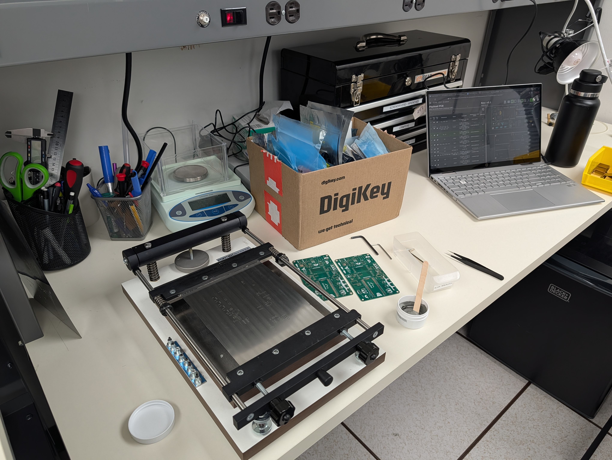
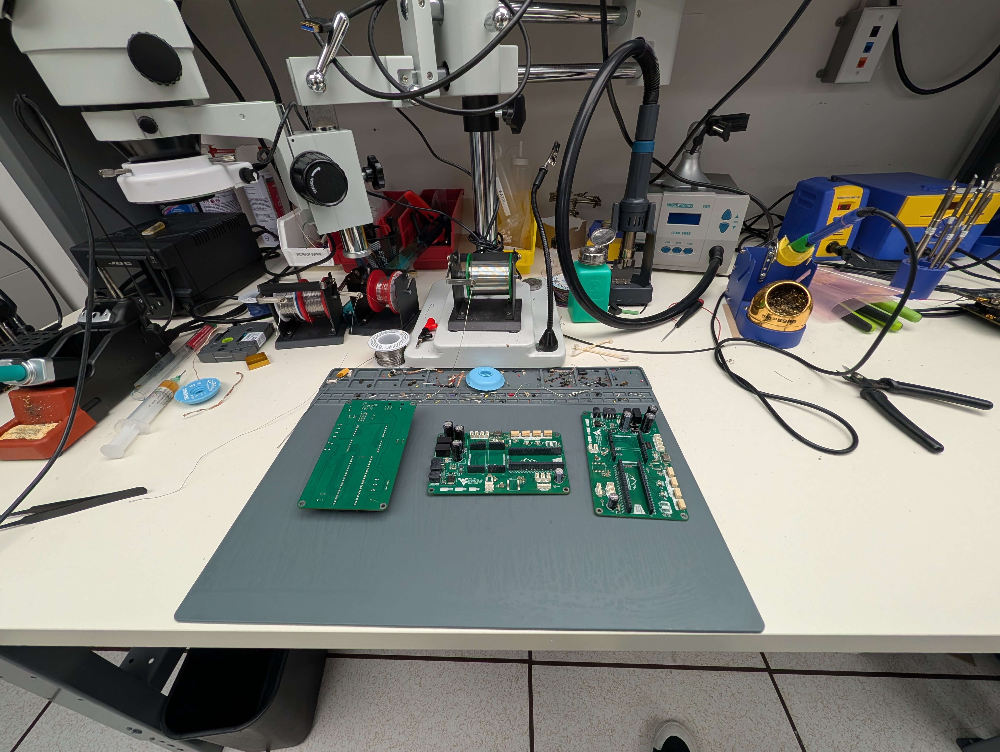
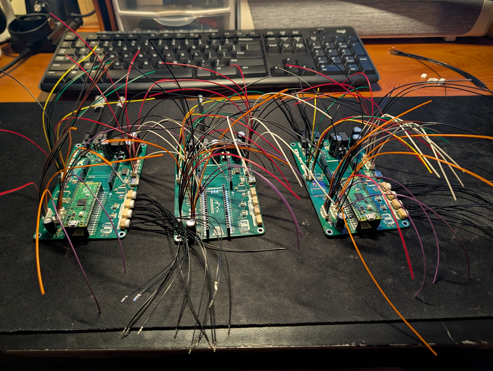
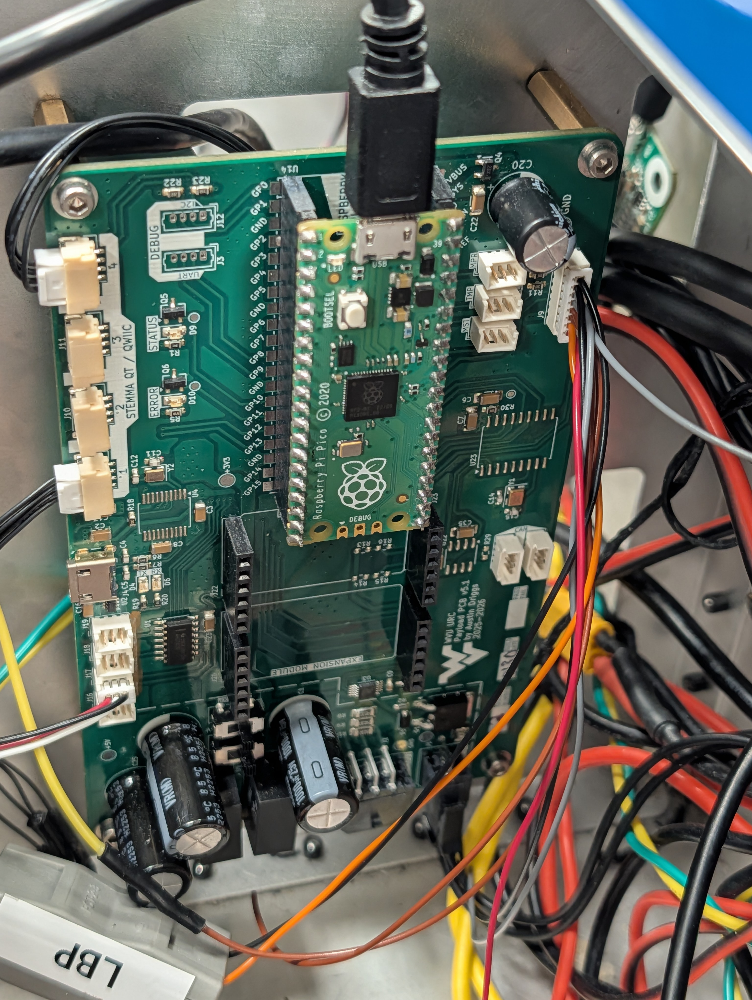

# Getting Started

> This file is a work in progress.

## GITHUB

Issue templates for everything below are stored in [.github/ISSUE_TEMPLATE](.github/ISSUE_TEMPLATE/).

Your commit history will be used as the `changes` in the [CHANGELOG](CHANGELOG). Commit responsibly.

## SUPPORT

The support folder contains some good references, datasheets, and files, but generally does not contain documentation I've wrote myself.

## KICAD

Ensure you are using the correct (or newer) version of KiCad for the specific version of the board you are checking out. This can be found in the [CHANGELOG](CHANGELOG).

## FABRICATION

When you tag and push your changes, it will create assets in the `releases` folder and update the change log with the revision history. Do not go back and change older releases, please keep them as legacy.

## ASSEMBLY

## WIRING

## TESTING

TODO

## PROGRAMMING

TODO

## INSTALLATION

