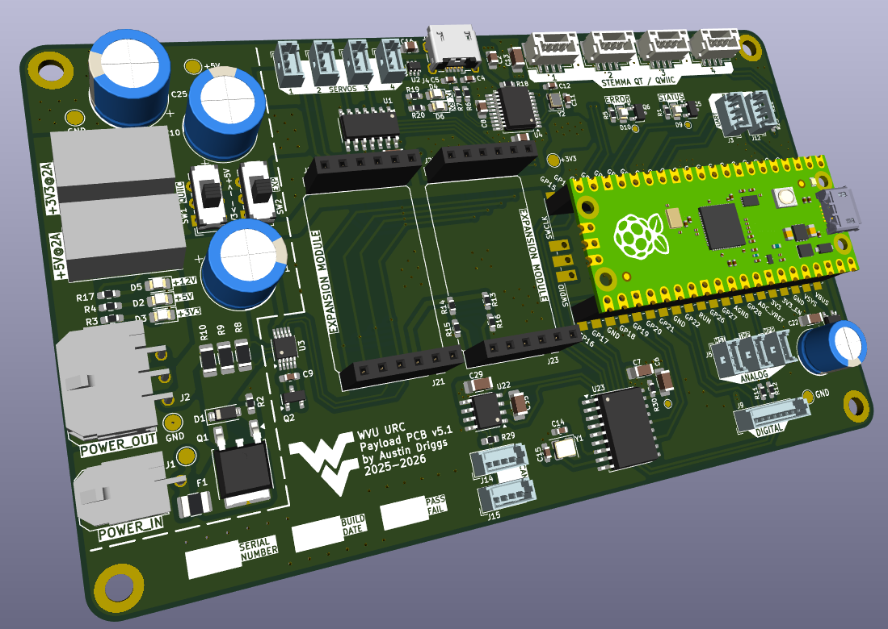
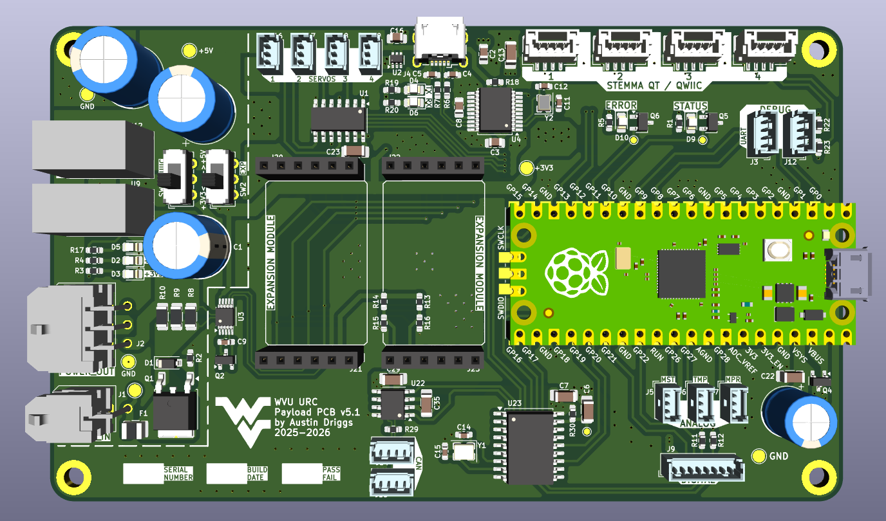
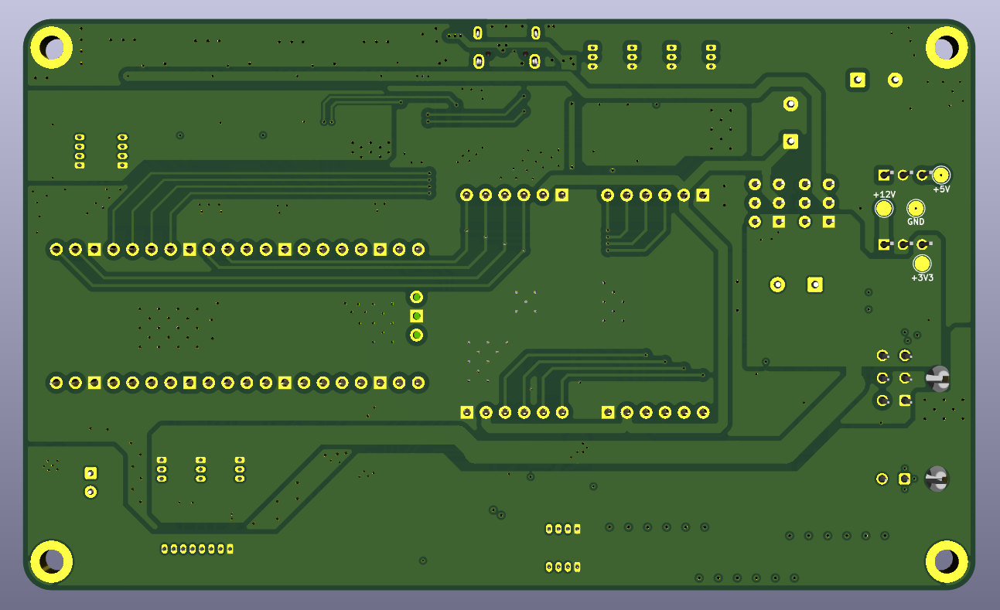

# Payload PCB

## SUMMARY

The Payload PCB serves as an all-purpose control and interface board that contains the Raspberry Pi Pico (RP2040) designed to manage mission-critical sensors and electronics and communicate that information through its Micro USB connector to the LattePanda Sigma SBC.

Learn how to [contribute](CONTRIBUTING) to this project.

## FEATURES

- Resettable PTC fuse and reverse voltage protection on +12V Molex Micro-Fit input.
- LTC2990 Quad I2C Voltage, Current, and Temperature Monitor.
- Traco TSR 2 Series +5V and +3V3 regulators: 96% eff, no heat sink required, built in filter caps, and short circuit protection.
- Outputs +12V, +5V, and +3V3 on Molex Micro-Fit.
- Status and error LEDs.
- Connections for both the Pico and an external device to CAN bus.
- 4x STEMMA QT / QWIIC connectors for COTS modules and peripherals.
- 2x custom expansion modules on two 6 pin 0.1" connectors each.
- 4x servo (PWM) outputs on Molex PicoBlades.
- 3x analog inputs on Molex Picoblades.
- 2x digital outputs for relays.
- 2x digital inputs (active-low) for limit switches on manipulator linear rail.
- Micro USB port to connect to Seeeduino XIAO on manipulator.

## DESIGN

### SCHEMATIC

TODO

### LAYOUT

### MODEL

TODO

## LICENSE

This project is published under the MIT [license](LICENSE).
